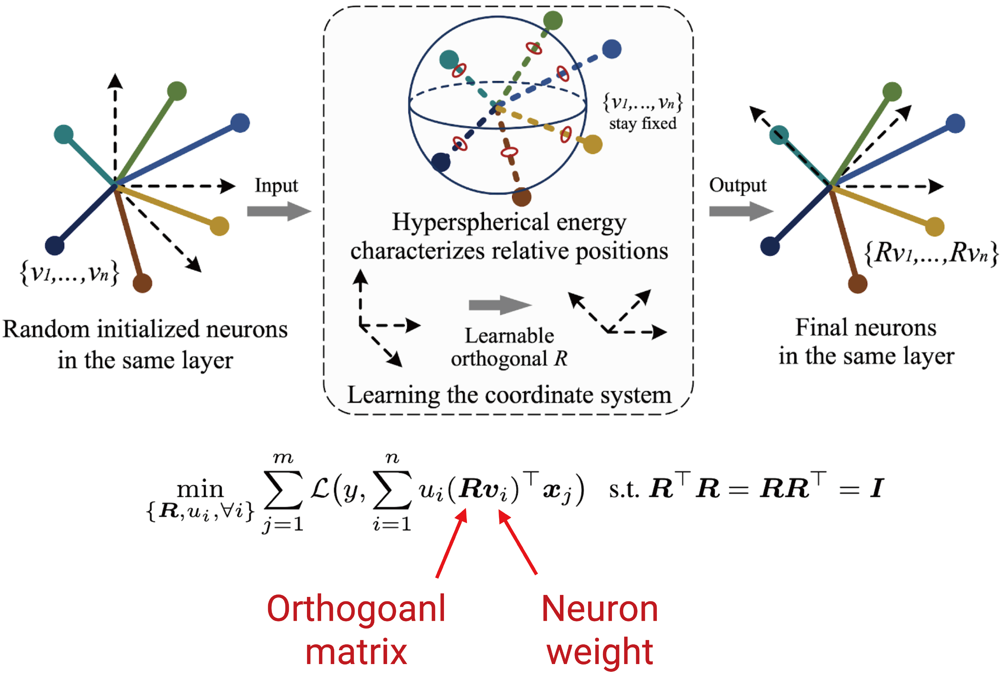

# Orthogonal Over-Parameterized Training

By Weiyang Liu, Rongmei Lin, Zhen Liu, James Rehg, Liam Paull, Li Xiong, Le Song, Adrian Weller

### License 
*OPT* is released under the MIT License (refer to the LICENSE file for details).

### Contents
0. [Introduction](#introduction)
0. [Citation](#citation)
0. [Short Video Introduction](#short-video-introduction)
0. [Requirements](#requirements)
0. [Usage](#usage)

### Introduction
The inductive bias of a neural network is largely determined by the architecture and the training algorithm. To achieve good generalization, how to effectively train a neural network is of great importance. We propose a novel orthogonal over-parameterized training (OPT) framework that can provably minimize the hyperspherical energy which characterizes the diversity of neurons on a hypersphere. See our previous work -- [MHE](https://wyliu.com/papers/LiuNIPS18_MHE.pdf) for an in-depth introduction.

By maintaining the minimum hyperspherical energy during training, OPT can greatly improve the empirical generalization. Specifically, OPT fixes the randomly initialized weights of the neurons and learns an orthogonal transformation that applies to these neurons. We consider multiple ways to learn such an orthogonal transformation, including unrolling orthogonalization algorithms, applying orthogonal parameterization, and designing orthogonality-preserving gradient descent. For better scalability, we propose the stochastic OPT which performs orthogonal transformation stochastically for partial dimensions of neurons. 

**Our OPT is accepted to [CVPR 2021](http://cvpr2021.thecvf.com/) as oral presentation and the full paper is available on [arXiv](https://arxiv.org/abs/2004.04690) and [here](https://wyliu.com/papers/LiuOPT2021_v6.pdf).**



### Citation
If you find our work useful in your research, please consider to cite:

    @InProceedings{Liu2021OPT,
        title={Orthogonal Over-Parameterized Training},
        author={Liu, Weiyang and Lin, Rongmei and Liu, Zhen and Rehg, James M. and Paull, Liam 
         and Xiong, Li and Song, Le and Weller, Adrian},
        booktitle={CVPR},
        year={2021}
    }

### Short Video Introduction
We also provide a short video introduction to help interested readers quickly go over our work and understand the essence of OPT. Please click the following figure to watch the Youtube video.

[](https://youtu.be/Oy8c1t1nonU)


### Requirements
1. `Python 3.7` 
2. `TensorFlow 1.14.0`

### Usage
This repository provides both OPT and S-OPT implementations on CIFAR-100 as a demostration.

#### Part 1: Clone the repositary
```Shell  
git clone https://github.com/wy1iu/OPT.git
```
#### Part 2: Download the official CIFAR-100 training and testing data (python version)
```Shell  
wget https://www.cs.toronto.edu/~kriz/cifar-100-python.tar.gz
```

#### Part 3: Train and test with the following code in different folder. 
```Shell
# Run Cayley Parameterization OPT
cd opt_cp
python train.py
```
```Shell
# Run Gram-Schmidt OPT
cd opt_gs
python train.py
```

```Shell
# Run Householder Reflection OPT
cd opt_hr
python train.py
```

```Shell
# Run Lowdin’s Symmetric OPT
cd opt_ls
python train.py
```

```Shell
# Run Orthogonality-Preserving Gradient Descent OPT
cd opt_ogd
python train.py
```

```Shell
# Run Stochastic OPT (Gram-Schmidt)
cd sopt_gs
python train.py
```
### Contact

- [Weiyang Liu](https://wyliu.com)
- [Rongmei Lin](https://rmlin.github.io/)
